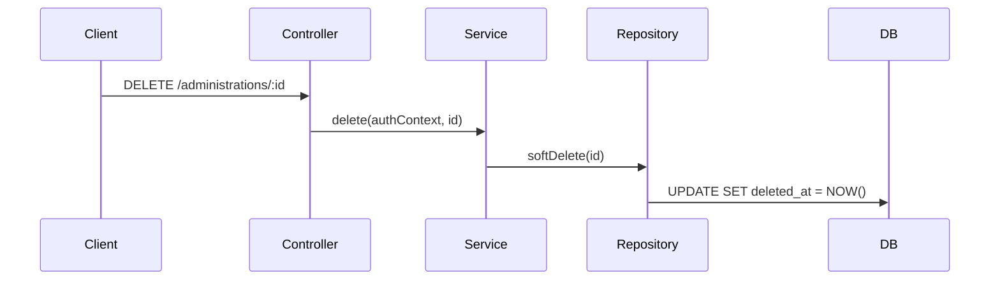

## PR creation

Conventions for creating pull requests in this repository.

### Branch naming

Use a prefix that matches the type of change, followed by the ticket number and a short description:

```
<prefix>/<ticket-number>/<short-description>
```

| Prefix | Use for | Example |
|--------|---------|---------|
| `enh/` | New features and enhancements | `enh/1649/backend-testing-infra` |
| `fix/` | Bug fixes | `fix/1580/consent-modal` |
| `refactor/` | Refactoring | `refactor/1602/compute-task-data` |
| `maint/` | Maintenance and housekeeping | `maint/1700/agent-rules` |
| `dep/` | Dependency updates | `dep/bump-phoneme-4-0-0` |
| `infra/` | Infrastructure changes | `infra/1685/cloud-run-deployment` |

Always include the ticket number. Every meaningful change should have a corresponding GitHub issue for traceability. The rare exception is mechanical work like dependency bumps (`dep/`) where a ticket adds no value — but if there's no ticket, ask yourself whether there should be.

### Commit messages

Imperative verb phrase, sentence-cased, no trailing period, no conventional commit prefix:

```
Add DELETE /v1/administrations/:id endpoint
Fix score type and language for normed palabra tasks
Refactor PA skills-to-work-on logic to use percentCorrect
```

### Draft mode

Create pull requests in draft mode by default so a human reviewer can mark them ready for review.

### PR description

Start with a `## Summary` heading. The first sentence should begin with "This PR …" and give a clear, concise explanation of the changes. Add further `##` headings and subheadings below if more detail is needed. For architectural or flow changes, include Mermaid diagrams where they add clarity.

Always link the ticket at the very end of the description with `Resolves #NNNN`.

```markdown
## Summary

This PR adds a DELETE /v1/administrations/:id endpoint that soft-deletes
an administration and cascades to junction tables.

## Authorization behavior

- Super admins can delete any administration
- Org admins can only delete administrations within their org tree

## Data flow



Resolves #1649
```

### PR title

PRs are squash-merged to `main`, so the PR title becomes the commit message in the main branch history. Write it with the same care as a commit message — imperative verb phrase, sentence-cased, specific enough to be meaningful in `git log`:

```
Add DELETE /v1/administrations/:id endpoint
Fix timezone handling in score report exports
Refactor access controls to use ltree subqueries
```

A vague title like "Update backend" or "Fix bug" pollutes the main branch history permanently.

### Size limits

Keep PRs small and focused — one concern per PR. If a change spans multiple layers (contract, repository, service, controller, route), that's fine as long as it's a single feature or fix. Split unrelated changes into separate PRs.

### Chaining PRs

When building out a larger feature, chain PRs by branching each one off the previous:

```
main → enh/1649/admin-repository → enh/1649/admin-service → enh/1649/admin-controller
```

Each PR targets the previous branch, keeping diffs small and reviewable. Merge them bottom-up once approved.

### Before pushing

Run these from the repo root to catch issues before CI does:

```bash
npm run lint          # ESLint
npm run format:check  # Prettier
npm run check-types   # TypeScript
npm run test          # Unit + integration tests
```

### The principle

Small, well-described PRs get reviewed faster and are easier to revert. Draft mode prevents premature reviews. Running checks locally before pushing avoids wasted CI cycles and noisy PR timelines.
