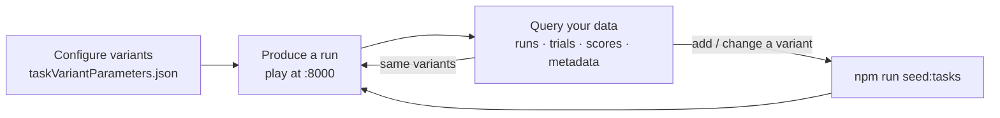

# Assessment Environment — Research Guide

How to produce assessment data locally and query it — the day-to-day research loop. This is the companion to the **[Setup & Operations guide](./ASSESSMENT_ENVIRONMENT.md)**; start there to install and run the environment.

Everything here assumes the environment is up (`npm start` from an assessment directory).

---

## The research loop

Local assessment work is a tight loop: configure the variants you want, play through the assessment to generate data, then query that data — and iterate.



- **Configure** and **seed** variants: see the setup guide's [Configuring task variants](./ASSESSMENT_ENVIRONMENT.md#configuring-task-variants). To pick up a newly added variant without losing data, use `npm run seed:tasks`.
- **Produce** and **query** are covered below.

---

## Producing a run

Open the dev server at **http://localhost:8000**. On load it:

1. Signs you in anonymously against the Firebase **Auth emulator**.
2. Provisions an anonymous ROAR user (your `participantId`) and resolves a task variant.
3. Launches the assessment. Playing it through writes a run, its trials, and — for scored assessments — its scores.

That's the whole data-generation path: **play the assessment, and rows appear.** There's nothing to POST by hand.

### Parameterizing a run with URL parameters

The variant's **game parameters** (adaptivity, item selection, language, etc.) always come from the seeded variant — not the URL. URL parameters select _which_ variant to run and attach participant/demographic context. The common ones (from the standalone `serve.js`):

| Parameter                                     | Purpose                                                           |
| --------------------------------------------- | ----------------------------------------------------------------- |
| `variantId`                                   | Run a specific seeded variant (otherwise the first published one) |
| `participant`                                 | Assessment participant id (PID) to associate with the run         |
| `grade`                                       | Participant grade                                                 |
| `birthyear`, `birthmonth`, `age`, `agemonths` | Participant age/DOB context                                       |
| `labId`                                       | Lab identifier                                                    |
| `taskVersion`                                 | Task version string (defaults to `1.0`)                           |

```
http://localhost:8000/?variantId=<id>&participant=demo-01&grade=3
```

Multi-task assessments (e.g. `roam-apps`) also take a task selector parameter — check that assessment's `serve.js` for its exact name. What of this context actually lands in the database depends on the assessment; inspect `runs.metadata` (see [Metadata](#extracting-metadata)) to see what was recorded.

To grab a specific `variantId`, use the [variant picker](#switching-variants-the-variant-picker) or the [seeded-variants query](#useful-queries).

> **Demographics vs. `run_demographics`.** The demographic URL params are not the `run_demographics` table — that table is populated from rostering and stays **empty for anonymous standalone runs**. If an assessment records these values at all, they land in `runs.metadata`, not `run_demographics`.

### Anonymous identity — and what a refresh does

Each standalone play is tied to your browser's Firebase Auth emulator user. That identity is **persisted in browser local storage**, so:

- **A page refresh keeps the same anonymous user** — and therefore the same ROAR participant. Repeated runs in the same browser accumulate under one user, which is what you usually want while iterating.
- **A fresh participant** comes from a different browser or profile, an incognito window, cleared site data, or an emulator wipe (`npm restart` / `npm stop` — the Auth emulator is in-memory and reset by both).

To find the run you just produced, sort by recency (see [the runs query](#useful-queries)) or filter on `is_anonymous = true`.

---

## Switching variants: the variant picker

In dev and staging (never production), a small **variant picker** appears in the top-right corner of the assessment — a dropdown of the task's published variants. Selecting one reloads the page with that `variantId` (preserving your other URL parameters), so you can hop between seeded variants without hand-editing the URL.

It lists the same published variants you seeded via `taskVariantParameters.json`, so pair it with `npm run seed:tasks`: add a variant, seed it, reload, and it's in the dropdown. If a variant you expect is missing, it wasn't seeded — re-check your config and re-run `npm run seed:tasks`.

**Scoped to the running assessment.** The picker queries `GET /tasks/:taskId/variants` for only the task ID(s) this assessment's dev server serves. So even though the shared database also holds every other assessment's variants once you've seeded them (see [switching between assessments](./ASSESSMENT_ENVIRONMENT.md#switching-between-assessments)), `roar-swr`'s picker never shows `roar-pa`'s variants. A multi-task or multi-language assessment shows all of _its own_ tasks' variants (e.g. `roar-swr` lists both English and Spanish), but never another assessment's.

---

## Querying your data

### PgWeb (recommended)

PgWeb is a browser-based SQL client — no config files, no GUI to install, just a URL.

```bash
# macOS
brew install pgweb
# Linux / other — download the binary from https://github.com/sosedoff/pgweb/releases
```

**Connect to `roar_core`** (users, tasks, variants):

```bash
pgweb --url "postgres://postgres@localhost:5433/roar_core?sslmode=disable"
```

Open http://localhost:8081 in your browser.

**Connect to `roar_assessment`** (trials, scores) — on a second port so you can browse both at once:

```bash
pgweb --url "postgres://postgres@localhost:5433/roar_assessment?sslmode=disable" --listen 8082
```

> The ephemeral database is on host port **5433**, not 5432 — see the [Connection reference](#connection-reference). (If you set `ASSESSMENT_PG_PORT` when starting the stack, use that port instead.)

### Database layout

All tables live in the `app` schema — prefix every table name with `app.`.

| Data                                                           | Database          | Table(s)                                                                     |
| -------------------------------------------------------------- | ----------------- | ---------------------------------------------------------------------------- |
| Users, tasks, variants                                         | `roar_core`       | `app.users`, `app.tasks`, `app.task_variants`, `app.task_variant_parameters` |
| Runs, scores, trials, interactions                             | `roar_assessment` | `app.runs`, `app.run_scores`, `app.run_trials`, `app.run_trial_interactions` |
| Runs + scores, joinable against users/tasks (read-only mirror) | `roar_core`       | `app_assessment_fdw.runs`, `app_assessment_fdw.run_scores`                   |

The last row is the key to cross-database joins: `runs` and `run_scores` are mirrored into `roar_core` via a foreign data wrapper, so you can join them against `app.users` and `app.tasks` in one query. **`run_trials` is not mirrored** — trial-level data is queryable only in `roar_assessment`.

### Useful queries

**All runs for a task, with the participant** — run in `roar_core`. (Anonymous dev runs have no name; `assessment_pid` is the useful identifier.)

```sql
SELECT
  r.id,
  u.assessment_pid,
  r.is_anonymous,
  r.completed_at,
  r.reliable_run,
  r.metadata
FROM app_assessment_fdw.runs r
JOIN app.users u ON u.id = r.user_id
JOIN app.task_variants tv ON tv.id = r.task_variant_id
JOIN app.tasks t ON t.id = tv.task_id
WHERE t.slug = 'pa'          -- the task slug, e.g. 'pa', 'swr', 'sre'
  AND r.deleted_at IS NULL
ORDER BY r.created_at DESC;
```

> **Multi-task / multi-language slugs.** Language-as-task assessments use language-suffixed slugs (`swr`, `swr-es`), and multi-task assessments have several slugs. Match with `t.slug LIKE 'swr%'`, or list the exact slugs, rather than a single `=` — otherwise you'll silently miss runs.

**Trial-level data for a specific run** — run in `roar_assessment`:

```sql
SELECT
  trial_num_total,
  item,
  correct,
  response,
  response_time_ms,
  subtask,
  assessment_stage
FROM app.run_trials
WHERE run_id = '<your-run-id>'
ORDER BY trial_index;
```

**Scores for completed runs** — run in `roar_assessment`:

```sql
SELECT
  r.id AS run_id,
  s.type,
  s.domain,
  s.name,
  s.value,
  s.assessment_stage,
  s.category_score
FROM app.run_scores s
JOIN app.runs r ON r.id = s.run_id
WHERE r.completed_at IS NOT NULL
  AND r.deleted_at IS NULL
ORDER BY r.completed_at DESC;
```

**Inspect what got seeded — and grab variant IDs for URLs** — run in `roar_core`. Use this to pull a `variantId` without opening the picker, or to confirm a `seed:tasks` landed:

```sql
SELECT
  t.slug  AS task,
  tv.id   AS variant_id,
  tv.name AS variant_name,
  tv.status,
  jsonb_object_agg(tvp.name, tvp.value)
    FILTER (WHERE tvp.name IS NOT NULL) AS params
FROM app.task_variants tv
JOIN app.tasks t ON t.id = tv.task_id
LEFT JOIN app.task_variant_parameters tvp ON tvp.task_variant_id = tv.id
GROUP BY t.slug, tv.id, tv.name, tv.status
ORDER BY t.slug, tv.name;
```

**Run summary — counts, engagement, reliability** — run in `roar_assessment`:

```sql
SELECT
  r.id,
  r.completed_at,
  r.aborted_at,
  r.reliable_run,
  r.engagement_flags,
  (SELECT count(*) FROM app.run_trials t WHERE t.run_id = r.id) AS trial_count,
  (SELECT count(*) FROM app.run_scores s WHERE s.run_id = r.id) AS score_count
FROM app.runs r
WHERE r.deleted_at IS NULL
ORDER BY r.created_at DESC;
```

`engagement_flags` is a JSONB object of booleans (`incomplete`, `responseTimeTooFast`, `accuracyTooLow`, `notEnoughResponses`); `reliable_run` is the assessment's overall verdict.

**Trial interactions (engagement events)** — focus/blur and fullscreen enter/exit during a run, in `roar_assessment`:

```sql
SELECT t.trial_index, i.interaction_type, i.time_ms
FROM app.run_trial_interactions i
JOIN app.run_trials t ON t.id = i.trial_id
WHERE t.run_id = '<your-run-id>'
ORDER BY t.trial_index, i.time_ms;
```

---

## Extracting metadata

Two tables carry a flexible `metadata` JSONB column, and it's where the assessment-specific data lives:

| Table            | `metadata` holds                                                                                                                                                                    |
| ---------------- | ----------------------------------------------------------------------------------------------------------------------------------------------------------------------------------- |
| `app.runs`       | Run-level context set when the run is created or completed (session info, summary, whatever the assessment passes)                                                                  |
| `app.run_trials` | **Any field a trial emits that doesn't map to a standard `run_trials` column.** Known fields (`item`, `correct`, `response_time_ms`, …) become columns; everything else lands here. |

> `run_scores` has **no** `metadata` column. To attach run-level metadata to a score, join the score to its run and read `runs.metadata` (last example below).

Because trial `metadata` is assessment-specific, the first move is usually to **discover what keys are present**:

```sql
-- Distinct metadata keys across a run's trials — run in roar_assessment
SELECT DISTINCT jsonb_object_keys(metadata) AS metadata_key
FROM app.run_trials
WHERE run_id = '<your-run-id>'
  AND metadata IS NOT NULL;
```

**Extract specific metadata fields** alongside real columns with the `->>` operator (text) or `->` (JSON):

```sql
SELECT
  trial_num_total,
  item,
  correct,
  metadata ->> 'someCustomField' AS some_custom_field,
  metadata -> 'nestedObject'     AS nested_object
FROM app.run_trials
WHERE run_id = '<your-run-id>'
ORDER BY trial_index;
```

**Filter trials by a metadata value.** `->>` compares as text; `@>` does a JSON containment match (and can use a GIN index):

```sql
SELECT trial_num_total, item, correct
FROM app.run_trials
WHERE run_id = '<your-run-id>'
  AND metadata ->> 'condition' = 'practice';

-- Containment form — matches rows whose metadata includes {"condition": "practice"}
SELECT trial_num_total, item, correct
FROM app.run_trials
WHERE run_id = '<your-run-id>'
  AND metadata @> '{"condition": "practice"}';
```

**Run-level metadata**, and inspecting what a run recorded:

```sql
-- roar_assessment
SELECT
  id,
  is_anonymous,
  completed_at,
  metadata,
  metadata ->> 'sessionId' AS session_id
FROM app.runs
WHERE deleted_at IS NULL
ORDER BY created_at DESC;
```

**Join scores to their run's metadata.** Since `run_scores` has no metadata of its own, pull it from the parent run — here from `roar_core` in a single cross-database join via the FDW mirrors:

```sql
-- roar_core
SELECT
  u.assessment_pid,
  t.slug           AS task,
  s.name           AS score_name,
  s.value          AS score_value,
  r.metadata ->> 'sessionId' AS session_id
FROM app_assessment_fdw.run_scores s
JOIN app_assessment_fdw.runs r ON r.id = s.run_id
JOIN app.users u ON u.id = r.user_id
JOIN app.task_variants tv ON tv.id = r.task_variant_id
JOIN app.tasks t ON t.id = tv.task_id
WHERE r.deleted_at IS NULL
ORDER BY r.completed_at DESC NULLS LAST;
```

---

## Exporting query results to CSV

Any query above can be exported to CSV — pick the option that fits how you're working.

**PgWeb** (the recommended client): run the query, then use the export control on the results toolbar and choose CSV. Best for one-off exports while you explore.

**psql `\copy`** — scriptable, and it writes to the machine where `psql` runs (not the container), so the file lands in your current directory. The whole `\copy` command must be on **one physical line**:

```bash
psql "postgres://postgres@localhost:5433/roar_assessment?sslmode=disable"
```

```sql
\copy (SELECT trial_num_total, item, correct, response_time_ms FROM app.run_trials WHERE run_id = '<your-run-id>' ORDER BY trial_index) TO 'trials.csv' WITH (FORMAT csv, HEADER)
```

**One-liner from the shell** — same result without an interactive session, handy for repeatable exports:

```bash
psql "postgres://postgres@localhost:5433/roar_assessment?sslmode=disable" --csv \
  -c "SELECT trial_num_total, item, correct, response_time_ms
      FROM app.run_trials WHERE run_id = '<your-run-id>' ORDER BY trial_index" \
  > trials.csv
```

Pick the database that matches the query: trial-level queries run against `roar_assessment`; participant/score joins that use the FDW mirrors run against `roar_core`. For a **single CSV combining participants, scores, and run metadata**, export the [cross-database join](#extracting-metadata) from `roar_core`.

---

## Resetting your generated data

To clear the runs, trials, scores, and interactions you've generated while **keeping your seeded tasks and variants**, truncate the run tables in `roar_assessment` — the foreign keys cascade from `runs`:

```sql
-- roar_assessment
TRUNCATE app.runs CASCADE;
```

`run_trials`, `run_scores`, and `run_trial_interactions` all cascade from `runs`, so this single statement wipes the generated data at once — far faster than a full teardown, and it leaves your `roar_core` tasks and variants untouched, so there's nothing to re-seed.

For a complete reset (tasks and variants too), use `npm restart` — but that destroys the whole database volume and re-seeds from scratch. See the setup guide's [script reference](./ASSESSMENT_ENVIRONMENT.md#script-reference).

---

## Viewing recordings (audio/video assessments)

Assessments that capture audio or video — e.g. Read Aloud (`roar-readaloud`) — upload recordings through the SDK to the local **Firebase Storage emulator**, so dev needs no cloud credentials and touches no real bucket. Browse them in the **Emulator UI** — nothing extra to install.

**Open the Emulator UI:** http://localhost:9000 → **Storage** tab.

The Storage tab lists the emulated **`demo-roar.appspot.com`** bucket — project `demo-roar`, so the full reference root is **`gs://demo-roar.appspot.com/`** — created on the first upload. It lets you browse and download blobs. Recordings are written under a deterministic path within it:

```
{taskId}/{participantId}/{assessmentPid}/{administrationId}/{runId}/{filename}
```

The third segment is `assessmentPid`, which falls back to `participantId` when the run has no PID — so for an anonymous dev run those two segments often match:

```
roar-readaloud/<participantId>/<participantId>/test-administration/<runId>/<filename>
```

Each recording's `gs://` reference is also written onto its trial. It isn't a standard trial column, so — like any assessment-specific field — it lands in **`run_trials.metadata`** (for Read Aloud, under the key `uploadUrl`; see [Extracting metadata](#extracting-metadata)). The reference's path portion matches the blob in the Storage tab: `gs://demo-roar.appspot.com/{taskId}/…/{filename}`.

**Lifetime.** The Storage emulator keeps recordings in memory — there is no import/export configured. They survive **Ctrl+C** (which stops only the dev server; the emulator container keeps running), but are cleared when the emulator container restarts (`npm restart`) or when you tear the environment down (`npm stop`).

---

## Connection reference

| Setting             | Value                         |
| ------------------- | ----------------------------- |
| Host                | `localhost`                   |
| Port                | `5433` (`ASSESSMENT_PG_PORT`) |
| Username            | `postgres`                    |
| Password            | _(none)_                      |
| Core database       | `roar_core`                   |
| Assessment database | `roar_assessment`             |
| SSL mode            | `disable`                     |

Port **5433** (not the standard 5432) lets the ephemeral stack coexist with a persistent platform-dev Postgres on 5432. If you started the stack with a custom `ASSESSMENT_PG_PORT`, use that instead.

**Command-line alternatives to PgWeb:**

```bash
# psql (no install needed if Postgres is already on your machine)
psql "postgres://postgres@localhost:5433/roar_core?sslmode=disable"

# pgcli (autocomplete)
pgcli postgres://postgres@localhost:5433/roar_assessment
```

**PgAdmin** (desktop GUI): create a server with host `localhost`, port `5433`, username `postgres`, and a blank password.
