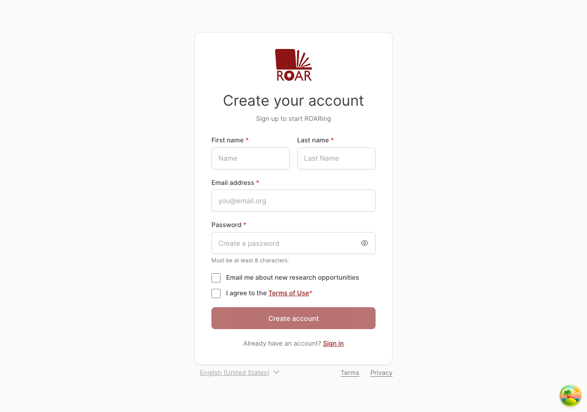
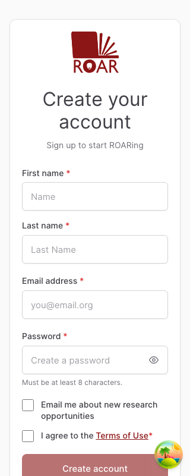

# Stage 1 signup quality evidence

This document records the automated and external acceptance evidence for the
ROAR at Home account-owner signup flow. A status of **Pass** means the behavior
is covered by a passing local automated test or recorded browser verification;
the evidence column identifies which applies. A status of **Pending external
approval** is intentionally not treated as an engineering pass.

## Acceptance scenarios

| Scenario                                     | Status | Evidence                                                                                                                                                                                    |
| -------------------------------------------- | ------ | ------------------------------------------------------------------------------------------------------------------------------------------------------------------------------------------- |
| Valid form and all required acknowledgements | Pass   | `SelfRegistration.integration.test.js` submits the normalized payload exactly once after explicit consent; `useSelfRegistration.test.js` verifies success and duplicate-request prevention. |
| Missing required field                       | Pass   | `AccountOwnerForm.test.js` verifies linked, actionable field errors and focus on the first invalid field.                                                                                   |
| Invalid email                                | Pass   | `AccountOwnerForm.test.js` distinguishes the missing-email and invalid-format messages and verifies that correction clears stale guidance.                                                  |
| Existing email                               | Pass   | `useSelfRegistration.test.js` maps `409` and `422` responses to actionable SignIn guidance.                                                                                                 |
| Consent opened and canceled                  | Pass   | `SelfRegistration.integration.test.js` verifies that cancellation leaves consent incomplete, preserves every owner field, and blocks account creation.                                      |
| Consent document cannot load                 | Pass   | `SelfRegistration.integration.test.js` verifies the error/retry path and no acceptance before confirmation; `ConsentModal.test.js` verifies the accessible alert and retry control.         |
| Future-contact checkbox is not selected      | Pass   | The integration test creates the account while optional contact remains unchecked; `useResearchConsent.test.js` verifies that toggling it cannot change required-acknowledgement readiness. |
| Successful signup and navigation             | Pass   | `RegistrationSuccess.test.js` verifies the focused confirmation heading and explicit `/signin` action.                                                                                      |
| Open signup without invitation context       | Pass   | `router/index.test.js` covers missing and malformed code-like query parameters; `AccountOwnerForm.test.js` verifies that no code field is rendered.                                         |

Registration context is not applicable to Stage 1. Invitation-code behavior is
owned by Stage 2 learner enrollment.

## Accessibility and responsive evidence

| Check                                        | Status | Evidence                                                                                                                                                                                                                        |
| -------------------------------------------- | ------ | ------------------------------------------------------------------------------------------------------------------------------------------------------------------------------------------------------------------------------- |
| Persistent labels and required semantics     | Pass   | `AccountOwnerForm.test.js` and `AccountOwnerForm.cy.js` verify labels, required controls, autocomplete values, and password guidance.                                                                                           |
| Field errors are programmatically associated | Pass   | Unit coverage verifies `aria-invalid`, `aria-describedby`, the correct message, and focus on the first invalid control.                                                                                                         |
| Consent interaction is accessible            | Pass   | `ConsentModal.test.js` verifies the dialog name, loading status, error alert, cancel/close behavior, and explicit confirmation.                                                                                                 |
| Success is announced through focus           | Pass   | `RegistrationSuccess.test.js` verifies that the result heading receives focus.                                                                                                                                                  |
| Form is contained at supported widths        | Pass   | Local Chrome captures at 1280×900 and an emulated 320×800 are committed below. At 320 px, `innerWidth`, `clientWidth`, and `scrollWidth` are all 320. `AccountOwnerForm.cy.js` repeats the containment and column checks in CI. |
| Keyboard submission                          | Pass   | `AccountOwnerForm.test.js` verifies the native form submission contract, so Enter and the submit button share one path.                                                                                                         |

### Browser captures

Desktop, Chrome at 1280×900:

Mobile, Chrome device emulation at 320×800:

The Cypress component test runs in both Chrome and Edge in CI and records named
element screenshots. Link the final CI run from the pull request before release
review is completed.

## Regression checks

| Area                           | Status | Evidence                                                                                                                                |
| ------------------------------ | ------ | --------------------------------------------------------------------------------------------------------------------------------------- |
| SignIn email/password          | Pass   | `useAuth.test.js`, `useSignInForm.test.js`, and `PasswordInput.test.js`.                                                                |
| SignIn provider flows          | Pass   | `useAuth.test.js`, `useProviders.test.js`, and `Providers.test.js`.                                                                     |
| OAuth popup/redirect selection | Pass   | `useAuth.test.js` verifies redirect-based Clever and desktop Google popup behavior.                                                     |
| Post-authentication redirect   | Pass   | `useAuth.test.js` covers Home, a valid `redirect_to`, and the SSO route; `redirectSignInPath.test.js` covers unsafe redirect rejection. |
| Shared routes and controls     | Pass   | The complete dashboard Vitest suite covers router guards, legal-document helpers, shared SignIn password controls, and modal consumers. |

## Product and research acceptance

| Approval                      | Status                    | Required record                                                                                                                                                                                                                      |
| ----------------------------- | ------------------------- | ------------------------------------------------------------------------------------------------------------------------------------------------------------------------------------------------------------------------------------ |
| Product acceptance criteria   | Pending external approval | Add reviewer name, review date, preview URL, and approval link.                                                                                                                                                                      |
| IRB/research consent behavior | Pending external approval | Confirm the default document key, displayed language, the absence of an additional checkbox inside the modal, explicit **Continue** confirmation, and cancel/close semantics. Add reviewer name, review date, and approval artifact. |

These rows must not be changed to **Pass** without the corresponding review
record. Automated tests demonstrate the implemented behavior but cannot grant
product or IRB approval.

## Known limitations and release gates

- The reCAPTCHA token gates the client submission but is not accepted or
  verified by the current `POST /v1/families/` backend contract.
- Research-consent metadata and the optional future-contact choice remain
  feature-local because the strict create-family request does not accept them.
  Research/engineering must confirm whether persistence is required before
  release.
- The legacy learner-enrollment Cypress flow remains skipped under Stage 2 and
  is not evidence for this Stage 1 release.
- CI must pass the dashboard Vitest suite, the Chrome/Edge Cypress component
  test matrix, lint, and the production build on the final pull request commit.

## Definition-of-done status

- [ ] Automated tests pass on the final CI commit. Local results may be recorded
      in the pull request, but do not replace CI.
- [x] Product acceptance scenarios are documented as pass/pending.
- [ ] IRB/research acceptance is recorded with reviewer, date, and artifact.
- [x] Automated accessibility checks and local responsive browser evidence are
      recorded; link the final Chrome/Edge Cypress run from the pull request.
- [ ] Product, research, and engineering have dispositioned every release gate
      above.
- [x] Known limitations and Stage 2 boundaries are documented.
